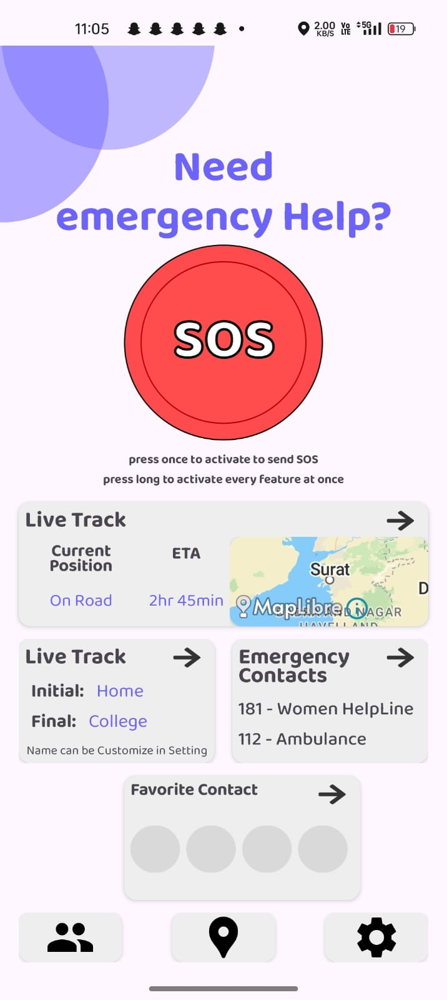

# Safe Track

## Empowering Women with Smart Safety on the Go

**Our app is a smart safety companion for women, offering real-time location tracking, emergency alerts, and route monitoring to ensure safe travel. With features like time-based check-ins, route deviation detection, and quick access to emergency contacts, we provide peace of mind for women and their loved ones — anytime, anywhere.**

## The Challenge We're Addressing

Our project addresses the growing concern for women's safety, especially during solo travel or in unfamiliar areas. Many existing solutions are either too passive or require manual input in high-stress situations. We created this app to offer proactive protection — by monitoring routes, detecting unusual delays or deviations, and triggering alerts automatically — so women can move confidently, knowing help is always within reach.

## Key Features

* **📍 Real-Time Location Tracking** – Continuously tracks user’s location during journeys.
* **🚨 Emergency Alerts** – Instantly notifies emergency contacts with live location in distress situations.
* **🗺️ Route Monitoring** – Detects deviations from planned routes and triggers alerts.
* **⏱️ Time Threshold Alert** – Sends check-in prompts if the journey takes longer than expected.
* **🛑 Movement Stagnation Detection** – Alerts if the user remains stationary for too long in one spot.
* **🧠 Smart Delay Handling** – Adjusts expected arrival time based on live traffic conditions.
* **🕵️‍♀️ Fake Shutdown Mode** – Disguises the app as shut down while silently sending emergency data.
* **☁️ Last Known Location Backup** – Sends final location before phone shutdown to the server.
* **✅ Automatic Journey Completion Notification** – Notifies emergency contact upon safe arrival.

## Target Audience

* **👩 Primary:** Women and girls seeking enhanced personal safety, especially while traveling alone.
* **👨‍👩‍👧 Secondary:** Concerned family members or friends who want to ensure their loved one’s safety.
* **🧑‍💻 Tertiary:** NGOs, safety organizations, and communities focused on women’s safety and empowerment.

## Installation Instructions

🚧 **Note: The app is currently under development and not yet available for public installation.**

Please stay tuned — once the project is complete, we’ll provide a direct APK download link and step-by-step instructions for installation and setup. Thank you for your patience and support!

## Usage Instructions

🚧 **Note: This feature will be available once the project is complete.**

When the app is ready, users will be able to:

* Set start and end locations for their journey
* Enable live location tracking
* Automatically alert emergency contacts during unsafe situations
* Access smart safety features like time checks, route monitoring, and fake shutdown mode

📱 Detailed user instructions, screenshots, and walkthroughs will be added after release.

## Project Structure (Coming Soon)

Once the codebase is finalized, this section will outline the app’s folder and module structure, including:
app/ – Core Android source files
ui/ – Screens, navigation, and UI components
services/ – Location, alert, and background services
data/ – Firebase and local data handling
utils/ – Helper classes and constants

## API Documentation

📡 Our app may use custom REST APIs and Firebase Cloud Functions to handle alerts and user data.

✅ Full API documentation will be published after integration is complete.

## Environment Variables (To Be Defined)

The final app may require the following environment variables:

* `FIREBASE_API_KEY` – Firebase access
* `MAP_LIBRE_TOKEN` – For rendering maps using MapLibre
* `ALERT_SERVER_URL` – Endpoint for emergency alert transmission

## Project Status and Future Plans

**Current Status:**

🚧 The project is currently under active development.

Our team is in the process of building core features, testing critical functionalities, and refining the user experience for a reliable safety app. A beta version will be released soon.

**Planned Features / Roadmap:**

* 🔹 **Multi-Stop Journey Support:** Allow users to add planned stops without triggering false alerts.
* 🔹 **AI-Based Anomaly Detection:** Use machine learning to detect unusual patterns in user movement for smarter alerts (using some AI dependency).
* 🔹 **Voice Activation for Emergency Mode:** Trigger emergency alerts using predefined voice commands.
* 🔹 **Offline Mode:** Store location data and send it automatically once internet connectivity is restored.
* 🔹 **Live Journey Sharing:** Enable users to share live journey status with family and friends.
* 🔹 **Community Safe Zones:** Let users mark and view safe places added by others (crowdsourced safety zones).

## Technologies Used

* **Mobile Development:** Android Studio, Kotlin
* **Web Technologies (Potential Backend/Admin):** HTML, CSS, JavaScript, PHP
* **Backend & Cloud:** Firebase
* **Mapping:** Route and Maps (likely leveraging libraries like MapLibre)
* **AI:** Some AI dependency (details to be specified as development progresses)

## Licensing

📄 **License Information:**

This project will be released under the MIT License upon completion.

This allows others to freely use, modify, and distribute the code, provided proper attribution is given.

*(Note: License details will be included in the final release along with a LICENSE file in the repo.)*

## Credits and Acknowledgements

**👥 Authors / Maintainers:**

* harsh galiyawala
* sahil kayasth
* sahil patel
* rishav nagarkoti

**💡 Acknowledgements:**

We’d like to thank:

* **Firebase** – for providing powerful backend tools
* **MapLibre & OpenStreetMap** – for their open and flexible map technologies
* **Android Developer Community** – for ongoing inspiration and solutions
* Our friends and mentors – for their feedback, support, and encouragement
* Women around the world – whose safety inspired this project
---

# Safe Track - Project Shutdown Announcement

It's with a heavy heart that I must share the news: the Safe Track project, on which I've poured the last three months of my time and energy, is being shut down. My initial motivation was deeply rooted in the desire to create an app that truly empowers women and enhances their safety. The thought that no one had quite tackled this specific approach before fueled my dedication. However, after months of intensive work, I've come to understand the significant complexities involved in bringing this vision to life as a solo developer.

### Challenges Faced

1. **Restrictions on Background Automation in Android**: Achieving the level of seamless automation I envisioned is significantly restricted by the Android operating system's limitations on background processes.
2. **Too Many Edge Cases**: Ensuring the app functions reliably across a multitude of scenarios and potential issues has revealed an overwhelming number of edge cases that require careful consideration and coding.
3. **My Current Knowledge as a Fresher**: As a relatively new developer, I've come to realize that my current knowledge and skill set are, unfortunately, a limiting factor in effectively navigating these complex technical hurdles.
4. **Excessive Time Commitment**: The project has demanded countless days and nights of work, and while I was prepared for a significant time commitment, the reality of balancing this with my academic responsibilities as a college student – assignments, exams, vivas – has become unsustainable.
5. **Memory Issues**: Maintaining continuous background location tracking and other real-time features has presented significant challenges in terms of memory management.
6. **Performance Issues**: Ensuring the app remains responsive and doesn't negatively impact the user's device performance while running in the background has proven difficult.
7. **Battery Life Concerns**: Continuous location tracking and background processes inevitably lead to significant battery drain, which is a critical concern for a safety-focused application.
8. **Overwhelming Scope for a Solo Developer**: The sheer scope and complexity of building a robust and reliable real-time safety application with all the intended features is simply too much for a single developer to handle effectively.
9. **Time vs. Financial Constraints**: As a college student, my time is limited due to academic commitments, and the extended development time without any immediate financial return is not sustainable.
10. **Cost of Real-time Features (Storage)**: Implementing and maintaining the backend infrastructure required for real-time location tracking and data storage incurs ongoing costs that are beyond my current capacity.

Ultimately, the combination of these technical limitations, the overwhelming scope for a solo developer with my current experience level, and the constraints of time and resources has led to the difficult decision to shut down the Safe Track project. It's a disheartening conclusion after such dedicated effort driven by a sincere desire to contribute to women's safety.
